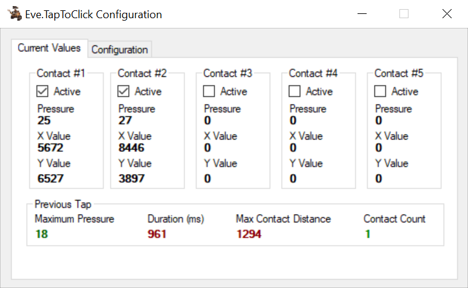
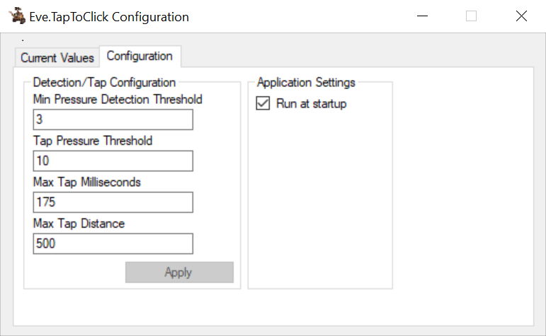

# Eve.TapToClick
This is a simple program that enables tap-to-click on the touchpad when running Windows 10 on a Google Pixelbook.

## Screenshots

Thanks to MrChromebox's efforts, Windows 10 can now be installed and works pretty well on the Pixelbook. One of the few issues is that native tap-to-click does not work. For now, this program serves as a workaround.

This app uses Windows' [raw input API](https://docs.microsoft.com/en-us/windows/win32/inputdev/raw-input) to access the touchpad's raw data, such as the pressure and X/Y readings. Using this data, it determines when a tap has occurred then injects the click input.

It allows some configuration, such as the pressure thresholds as well as the maximum time/distance for an input to be considered a tap.

Currently, only single-finger tap (for left click), double-finger tap (for right click), and triple-finger tap (for middle click) are implemented. Other gestures, such as double-tap-and-drag do not work.

If you have issues or questions, open an issue and I'll try to help you out. If you want to improve it, feel free to open a pull request.

## Important
**For best results, run this program as administrator.** Otherwise, some applications (I think ones that are run as administrator) will ignore the injected inputs.

**It is possible anti-virus apps may block the app from injecting mouse clicks.** This is because some malware uses the same method to maliciously control a victim PC. You may need to "allow" this program in your anti-virus software.

**I do not recommend using this when playing games that use anti-cheat features**. While I can't be completely sure, I suspect some anti-cheat software will flag the injected inputs as macroing software. If you get a ban because of this, I'm not responsible.

## How to use
Just [download the latest release](https://github.com/megabytefisher/Eve.TapToClick/releases), then unzip it and run the installer. After installation, run the program from the start menu. You can set the program to auto-start on system startup from the configuration tab.

## Configuration
Value Name | Description/What it does
--- | ---
Min Pressure Detection Threshold | The minimum pressure reading that must be read to consider the contact "active". Anything below this pressure is completely ignored. This should be as low as possible, but setting it too low (i.e. 1) can cause the X/Y position readings to come back with high variance. This may push what **should** have been a tap over the max distance threshold.
Tap Pressure Threshold | The minimum pressure that must be met to consider the input a tap.
Max Tap Milliseconds | The maximum time a contact can be active and it still be considered a tap.
Max Tap Distance | The maximum distance the contact can move and it still be considered a tap.

Basically, for an input to be considered a tap, it needs to exceed the minimum pressure, then reach the tap pressure, then fall back below the minimum pressure within the max tap milliseconds while not traveling farther than the max tap distance.
